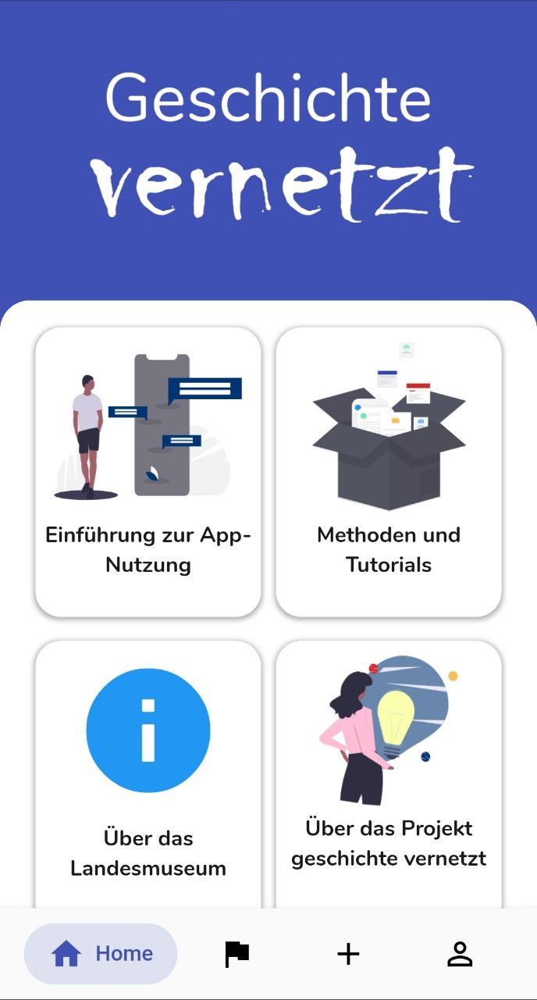
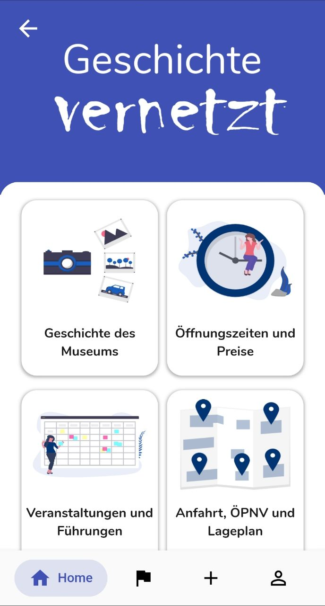
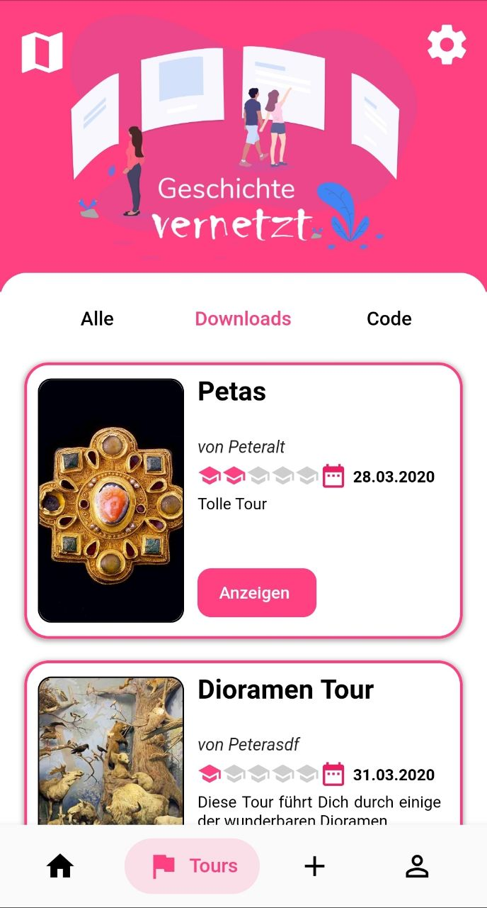
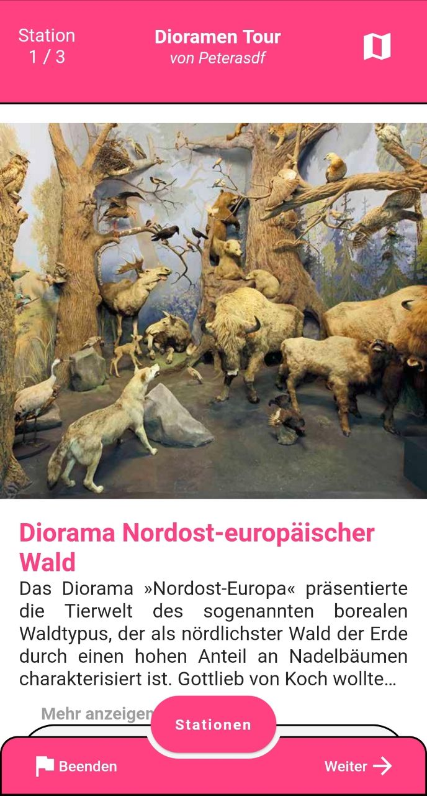
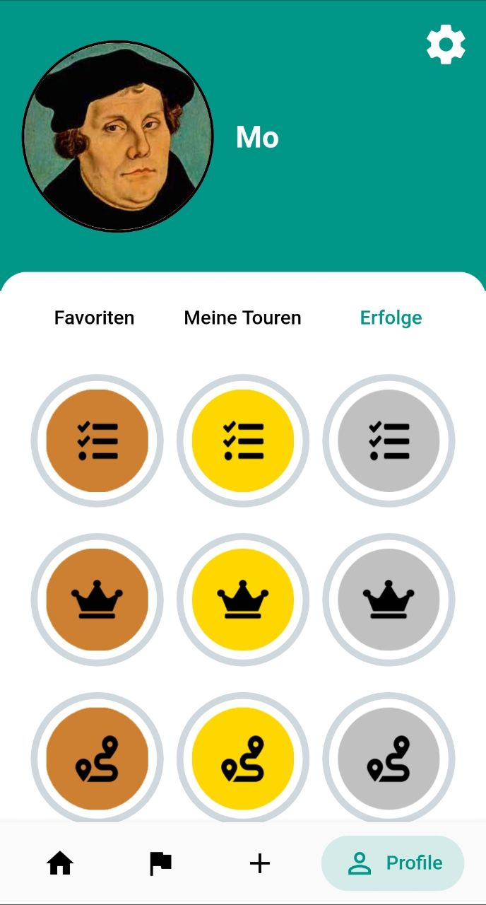

# Geschichte Vernetzt (History Connects)

A Flutter project for the museum lovers.

## About Project

This project is part of our bachelor project at TU Darmstadt.

There are situations that teacher wants to take his/her students for a visit in a museum but the teacher wants to have a custom tour. A tour with some questions and a custom routing. This app makes this happen. This app enables teachers to create custom tours in any museum. In version 1.0.0 we have worked closely with Hessisches Landesmuseum Darmstadt to enable teachers to create their own custom tours.

The App is eqipped with gamification so there is always a challenge in the background and you can earn badges/points and if you are good enough you can unlock some limited edtion profile pictures. (this part is under development)

The Project is accompanied with backend and web admin portal to support this application.

## Screenshots

| Onboarding Page                                       | Home Page                                           |
| ----------------------------------------------------- | --------------------------------------------------- |
|  |  |

| Museum Page                                           | Tour Page                                            |
| ----------------------------------------------------- | ---------------------------------------------------- |
|  |  |

| Example Tour                                            | Profile Page with Gamification                                      |
| ------------------------------------------------------- | ------------------------------------------------------------------- |
|  |  |

## Acknowledgment

Thanks to everyone who has helped us in this project.

## Contact

Mo Masoumi (mohammadrahim.masoumi@stud.tu-darmstadt.de), Robert Cieslinski (robert.cieslinski@stud.tudarmstadt.de), Shayan Davari Fard (shayan.davarifard@stud.tudarmstadt.de), Patrick Dzubba (Patrick.Dzubba@stud.tudarmstadt.de)
